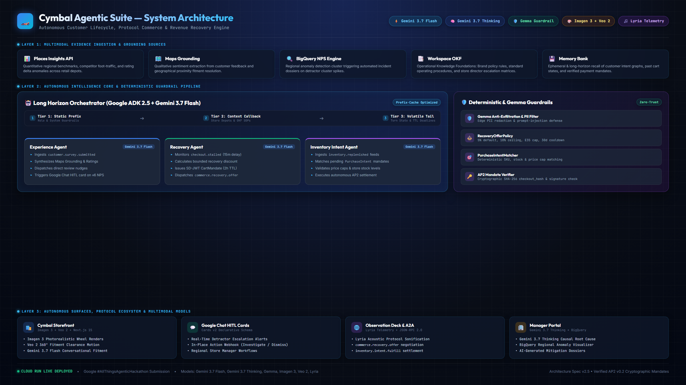

# 🏢 Cymbal Agentic Suite: The Autonomous Enterprise Fleet

> **Built for the [Google #AllThingsAgenticHackathon](https://allthingsagentichackathon.devpost.com/) — The Fortified Enterprise Fleet Track (Startup Excellence)**  
> An autonomous, protocol-driven commerce and reputation suite powered by **Google ADK 2.5**, **Gemini 3.7 Flash**, **Gemini 3.7 Pro / Thinking**, **Gemma**, **Imagen 3**, **Veo 2**, **Lyria**, **AP2 v0.2 (Autonomous Payment Protocol)**, **Agent-to-Agent (A2A)**, and **Universal Commerce Protocol (UCP)**.

[](#) *(<- Link your video here!)*
[](LICENSE)
[](https://cymbal-storefront-r6vqjlotga-uc.a.run.app)
[](#)
[](docs/GOOGLE_AI_MODELS.md)
[](#)

---

## 📖 Overview

For a national enterprise or franchise with hundreds of physical locations, managing local digital visibility, supply chain synchronization, and unstructured feedback is a multi-million-dollar logistical challenge. When physical inventory fluctuates or store policies change, local SEO profiles (like Google Business Profiles) lag behind, resulting in lost organic rankings, stalled checkouts, and damaging 1-star reviews.

The **Cymbal Agentic Suite** is a Zero-Trust, Multi-Agent Fleet built on the **Google Agent Development Kit (ADK 2.5)** that autonomously bridges physical supply chains and local search intent securely, asynchronously, and cryptographically.

---

## 🏗️ Architecture Blueprint



> **[👉 View Interactive System Blueprint (docs/architecture_diagram.html)](docs/architecture_diagram.html)** | **[👉 Download Print-Ready PDF Blueprint (docs/assets/architecture_diagram.pdf)](docs/assets/architecture_diagram.pdf)**

```text
                                        ┌──────────────────────────────────────┐
                                        │          EVIDENCE SOURCES            │
                                        │  Places Insights (Quantitative)      │
                                        │  Maps Grounding (Qualitative)        │
                                        │  BigQuery (Regional NPS Anomalies)   │
                                        │  Workspace OKF (Brand SOPs)          │
                                        │  Memory Bank (Agent Recall)          │
                                        └──────────────────┬───────────────────┘
                                                           │
                                                           ▼
                                        ┌──────────────────────────────────────┐
                                        │      LONG HORIZON AGENT (ADK 2.5)    │
                                        │     FastAPI + Gemini 3.7 Flash       │
                                        └──────┬───────────┬────────────┬──────┘
                                               │           │            │
                                               ▼           ▼            ▼
┌──────────────────────────────────────┐ ┌─────────────┐ ┌────────────────────┐ ┌────────────────────────┐
│        DETERMINISTIC ENGINES         │ │ GOOGLE CHAT │ │    A2A PROTOCOL    │ │   CYMBAL STOREFRONT    │
│  RecoveryOfferPolicy (5% cap, 2h TTL)│ │ Immediate   │ │  A2A JSON-RPC 2.0  │ │  Next.js 15 App Router │
│  PurchaseIntentMatcher (SKU/Price)   │ │ In-Place    │ │  commerce.recovery │ │  Vehicle Fitment Search│
│  AP2Verifier (checkout_hash / SD-JWT)│ │ Action Card │ │  inventory.intent  │ │  A2UI Card Renderer    │
└──────────────────────────────────────┘ └─────────────┘ └────────────────────┘ └────────────────────────┘
```

---

## 🤖 Google AI Multi-Model Portfolio

> **[👉 Detailed Google AI Models Architecture & Compliance Guide (docs/GOOGLE_AI_MODELS.md)](docs/GOOGLE_AI_MODELS.md)**

| Google Model | Role in Suite | Layer | Key Capability |
| :--- | :--- | :--- | :--- |
| **Gemini 3.7 Flash** *(Required: ≥3.5)* | **Long-Horizon Orchestrator & Autonomous Sub-Agents** | Core Engine | Prefix-cached multi-turn reasoning, native tool use, sub-agent dispatch, buying assistant. |
| **Gemini 3.7 Pro / Thinking** | **Manager Incident Dossier & Anomaly Root-Cause** | Manager Portal | Deep causal reasoning on Places Insights, Maps Grounding, and BigQuery NPS anomalies. |
| **Gemma (Gemma 2 / 4)** | **Zero-Exfiltration Edge Guardrail & Anti-PII Filter** | Policy Engine | Fast local PII sanitization and prompt injection defense prior to external A2A dispatch. |
| **Imagen 3** | **Fitted Wheel Visualizer & A2UI Promotional Creatives** | Storefront & A2UI | Photorealistic alloy wheel & tyre renders, dynamic vehicle fitment previews. |
| **Veo 2** | **360° Dynamic Vehicle Fitment & Motion Previews** | Visualizer | Generative vehicle clearance animations & rotating alloy wheel previews. |
| **Lyria** | **Observation Deck Audio Sonification & Voice Cues** | Telemetry Deck | Dynamic acoustic indicators for protocol events, mandate verifications & escalations. |

---

## ✨ Core Features & The Agent Registry

Instead of relying on a single brittle LLM, Cymbal routes commerce and reputation events through a registry of specialized agents:

* **The Memory Bank (OKF Agent):** Continuously ingests internal PDFs and inventory feeds, structuring unstructured enterprise data into the Open Knowledge Format (OKF).
* **The Pulse Agent:** Monitors physical ERP/inventory systems via MCP (Model Context Protocol).
* **The Code-Gen & SEO Agents:** Detects out-of-stock items and asynchronously drafts Schema.org JSON-LD updates via GitHub PRs and UCP (Universal Commerce Protocol) payloads.
* **The Gateway (A2UI & Google Chat Agent):** Pauses execution to generate a native UI component (A2UI) in the customer UI or an in-place interactive card in Google Chat for 1-click human-in-the-loop approval, strictly governed by **Model Armor** and **Exfil Guard**.
* **The Buying Assistant:** Conversational vehicle fitment expert (Gemini 3.7 Flash) assisting customers with tyre dimensions, load indexes, and offset clearance.
* **Executive Anomaly Dossier:** Forensic root-cause engine (Gemini 3.7 Pro) synthesizing BigQuery regional NPS clusters with Places Insights competitive benchmarks.

---

## 🔄 The 3 Core Autonomous Loops

### 1. Post-Purchase Review Generation & Closed-Loop Escalation
- **Customer Facing**: Every customer receives an un-gated, neutral link to leave honest feedback on Google Business Profile.
- **Internal Action**: Detractor feedback ($\le 6/10$) triggers Long Horizon to generate an incident dossier combining BigQuery regional anomaly data and Places Insights competitive benchmarks.
- **Google Chat Operational Surface**: An interactive card is posted to the local store manager's Google Chat space, allowing 1-click in-place resolution (`[⚡ Open Investigation]`, `[👤 Assign]`, `[✕ Dismiss]`).

### 2. Agent-Era Abandoned Cart Recovery
- **Trigger**: Stalled UCP checkout session (15m inactivity).
- **Deterministic Policy**: `RecoveryOfferPolicy` calculates a bounded recovery offer (5% default discount, £35 max cap, 1/30 days frequency, 2-hour TTL).
- **A2A Negotiation**: Dispatches `commerce.recovery.offer` to the consumer buyer agent, which renders an A2UI prompt on the user's screen.

### 3. Agent-Era Out-of-Stock (OOS) Inventory Recovery
- **Trigger**: Stock arrives at a local depot (`inventory.replenished`).
- **Deterministic Matcher**: `PurchaseIntentMatcher` matches SKU, store ID, quantity, and price caps against pre-authorized `OpenCheckoutMandate` criteria.
- **AP2 v0.2 Cryptographic Settlement**: Merchant creates the final UCP Checkout and signs the checkout JWT. Buyer's shopping agent provides the `ClosedCheckoutMandate` bound to `checkout_hash` and `PaymentMandate` for instant, autonomous settlement.

---

## 📸 Visual Walkthrough & System Screenshots

> **[👉 View Full Screenshot Gallery & Technical Annotations (VISUAL_WALKTHROUGH_AND_SCREENSHOTS.md)](docs/VISUAL_WALKTHROUGH_AND_SCREENSHOTS.md)**

| Homepage & Fitment Search | Guided Evaluator Tour (Driver.js) |
| :---: | :---: |
|  |  |
| **Gemini 3.7 Flash Buying Assistant** | **Fitted Wheel & Tyre Package Visualizer** |
|  |  |
| **Live Protocol Simulator & Telemetry** | **Manager Incident Audit Dossier & HITL Cards** |
|  |  |

---

## 🚀 Spin-Up & Deployment Instructions

### 1. Live Deployed Cloud Run Demo (Instant 60-Second Evaluation)
| Service | Live URL | Status | Description |
| :--- | :--- | :--- | :--- |
| **Storefront & Gemini Assistant** | [https://cymbal-storefront-r6vqjlotga-uc.a.run.app](https://cymbal-storefront-r6vqjlotga-uc.a.run.app) | `200 OK` | Next.js 15 Storefront & Buying Assistant |
| **Interactive Demo Controls** | [https://cymbal-storefront-r6vqjlotga-uc.a.run.app/demo-controls](https://cymbal-storefront-r6vqjlotga-uc.a.run.app/demo-controls) | `200 OK` | Event generator for all 3 autonomous agent loops |
| **Long Horizon Agent API** | [https://long-horizon-agent-r6vqjlotga-uc.a.run.app/a2a](https://long-horizon-agent-r6vqjlotga-uc.a.run.app/a2a) | `401 Auth Gated` | ADK 2.5 + FastAPI Agent-to-Agent JSON-RPC |
| **Agent Readiness Probe** | [https://long-horizon-agent-r6vqjlotga-uc.a.run.app/ready](https://long-horizon-agent-r6vqjlotga-uc.a.run.app/ready) | `200 OK` | Service metadata & readiness probe |

### 2. 1-Command Local Spin-up (Docker Compose)
```bash
# Clone the repository
git clone https://github.com/MrBigleg/cymbal-agentic-suite.git
cd cymbal-agentic-suite

# Set your Gemini API Key
export GEMINI_API_KEY="your-gemini-api-key"

# Build and start all services
docker compose up --build
```

### 3. Local Developer Setup (Monorepo)
```bash
# 1. Install Node/pnpm dependencies
pnpm install

# 2. Set up Python Long Horizon Agent
cd services/long-horizon-agent
python -m venv .venv
source .venv/bin/activate  # On Windows use `.venv\Scripts\activate`
pip install -r requirements.txt

# 3. Create .env with credentials
cp .env.example .env

# 4. Start local development servers
pnpm dev
```

### 4. Available Local Ports & Services
| Surface | Local URL | Description |
| :--- | :--- | :--- |
| **Storefront & Demo Simulator** | `http://localhost:3000/demo-controls` | Interactive event generator for all 3 agent loops |
| **Customer Store** | `http://localhost:3000` | Tyre e-commerce catalog and checkout flow |
| **Manager Incident Center** | `http://localhost:3000/manager/incidents/inc_001` | Escalation dossier with BigQuery & Places Insights evidence |
| **Long Horizon Agent API** | `http://localhost:8000/a2a` | Python ADK 2.5 Agent-to-Agent JSON-RPC endpoint |

### 5. Automated 1-Click Cloud Run Deploy Script
```bash
# Automated deployment of Agent & Storefront with Secret Manager integration
./scripts/deploy_cloud_run.sh --project-id "your-gcp-project-id" --region us-central1

# Or on Windows PowerShell:
.\scripts\deploy_cloud_run.ps1 -ProjectId "your-gcp-project-id" -Region us-central1
```
> For complete IAM policies, multi-stage Dockerfile specs, and private A2A auth, see [**docs/CLOUD_RUN_DEPLOYMENT_GUIDE.md**](docs/CLOUD_RUN_DEPLOYMENT_GUIDE.md).

---

## 🧪 Running Automated Tests & Verification Harness

### 1. Fast Unit & Protocol Tests
```bash
# Run deterministic commerce policy & AP2 verifier test suite
pnpm --filter @cymbal/deterministic-policy test

# Run A2A protocol schema tests
pnpm --filter @cymbal/commerce-protocol test

# Run Storefront app tests
pnpm --filter @cymbal/storefront test

# Run Long Horizon agent guardrail tests (Python)
cd services/long-horizon-agent && uv run pytest tests/unit/test_exfil_guard.py tests/unit/test_guardrails.py
```

### 2. Automated Programmatic Smoke Test Harness
```bash
# Test remote live Cloud Run deployment:
python scripts/smoke_test.py --target remote-storefront --url https://cymbal-storefront-r6vqjlotga-uc.a.run.app
python scripts/smoke_test.py --target remote-agent --url https://long-horizon-agent-r6vqjlotga-uc.a.run.app

# Or test local server processes:
python scripts/smoke_test.py --target agent --port 8080
.\scripts\smoke_test.ps1 -Target agent -Port 8080
```

---

## 🧠 Findings and Learnings

1. **Persistence ≠ Memory:** Initially, we encountered agent context drift and amnesia during multi-turn negotiation. Implementing a durable session service backed by Firestore (`DatabaseSessionService`) allowed our agents to maintain state across restarts, solving the "goldfish" memory issue in enterprise workflows.
2. **Idempotency in Long-Running Workflows:** Building a human-in-the-loop pause (`LongRunningFunctionTool` and Google Chat in-place interactive cards) meant the agent could suspend execution while waiting for manager action. We designed strict idempotency guards (bounded discounts, one-time action tokens, and SHA-256 checkout hashes) so the agent never issues duplicate offers or duplicate PRs upon resuming.
3. **Trajectory & Cryptographic Verification:** We learned to measure our agents based on their exact protocol execution trajectory (e.g., did it verify the inventory via MCP? did it enforce the 5% discount boundary?) rather than raw generated text, ensuring 100% compliance with corporate governance and preventing hallucinations.

---

## 📁 Repository Structure

```text
cymbal-agentic-suite/
├── apps/
│   ├── storefront/             # Next.js 15: Customer Shop, Vehicle Fitment, Stalled Cart, A2UI Cards
│   └── manager-portal/         # Next.js 15: Manager Incident Dossier & BigQuery Anomaly Center
├── services/
│   └── long-horizon-agent/     # Python 3.11: Google ADK 2.5 + Gemini 3.7 Flash + FastAPI A2A Handler
├── packages/
│   ├── commerce-protocol/      # Shared AP2 v0.2 (checkout_hash), UCP, and A2A schemas
│   └── deterministic-policy/   # Pure deterministic logic (RecoveryOfferPolicy, PurchaseIntentMatcher, AP2Verifier)
├── docs/
│   ├── CLOUD_RUN_DEPLOYMENT_GUIDE.md         # Production Google Cloud Run deployment & container guide
│   ├── VISUAL_WALKTHROUGH_AND_SCREENSHOTS.md # Complete visual tour with 8 high-res annotated screenshots
│   ├── assets/                               # Architecture blueprints (PNG/PDF/HTML), models stack, screenshots
│   ├── AGENT_ARCHITECTURE.md                 # Long Horizon hierarchy, 3-tier system prompts, guardrails
│   ├── PROTOCOL_SPEC.md                      # AP2 v0.2 checkout_hash, SD-JWT-VC, and A2A message contracts
│   ├── GOOGLE_CHAT_GUIDE.md                  # In-place interactive card life-cycle & app authentication
│   ├── SECURITY_EVALUATION_AND_HARDENING.md  # Threat modeling, cryptographic proofs, and SAIF compliance
│   ├── LOCAL_TESTING_AND_VERIFICATION.md     # Smoke testing harness & multi-layer verification guide
│   └── SESSION_HISTORY.md                    # Detailed engineering session changelogs & architectural decisions
├── scripts/                                  # Cloud Run deployment & automated smoke test scripts
└── docker-compose.yml                        # 1-command reproducible spin-up for judges
```

---

## 📜 Documentation Directory

- ☁️ [**Google Cloud Run Deployment Guide (Production & Serverless)**](docs/CLOUD_RUN_DEPLOYMENT_GUIDE.md)
- 🧠 [**Google AI Multi-Model Portfolio & Architecture Guide**](docs/GOOGLE_AI_MODELS.md)
- 🎨 [**Master Design System Specification (Wiry Neo-Brutalist)**](design.md)
- 📜 [**Development Session History (What & Why Changelog)**](docs/SESSION_HISTORY.md)
- 🧪 [**Local Testing & Verification Guide (Cloud Run Parity)**](docs/LOCAL_TESTING_AND_VERIFICATION.md)
- 🛡️ [**Security Evaluation & Hardening Architecture**](docs/SECURITY_EVALUATION_AND_HARDENING.md)
- 📖 [**Agent Architecture Deep-Dive**](docs/AGENT_ARCHITECTURE.md)
- 🔒 [**AP2 v0.2 & A2A Protocol Specifications**](docs/PROTOCOL_SPEC.md)
- 💬 [**Google Chat In-Place Card Integration**](docs/GOOGLE_CHAT_GUIDE.md)
- 📋 [**Design Specification (Specs)**](docs/superpowers/specs/2026-08-21-agentic-customer-lifecycle-design.md)

---

## 📄 License

This project is licensed under the Apache License, Version 2.0 - see the [LICENSE](LICENSE) file for details.

---

*Built with ❤️ by our Startup Team for the Google Cloud All Things Agentic Hackathon.*
