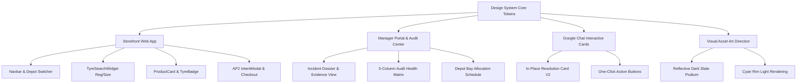

# 🏎️ Cymbal Agentic Suite — Master Design System Specification (`design.md`)

> **Google & Kaggle Agentic AI Hackathon Competition Entry**  
> **Theme Concept**: *Style B — Wiry Neo-Brutalist Slate & Cyan Rim Light*  
> **Target Surfaces**: Cymbal Tyres Customer Storefront, Autocentre Manager Portal, Google Chat Interactive Cards, Demo Control Center, and AI Asset Art Direction.

---

## 🏛️ Executive Design Philosophy: "Wiry Neo-Brutalist Precision"

The Cymbal Agentic Suite pairs the computational rigor of deterministic commerce protocols (AP2 v0.2, A2A, UCP) with a **high-contrast, dark-mode automotive engineering visual identity**. 

Instead of generic, muddy glassmorphism or soft blurry card gradients, this design system establishes:
1. **Signature Asymmetric Corner Geometry**: A distinct technical silhouette featuring a sharp, unrounded bottom-left corner (`border-radius: [T] [T] [T] 0px`) across all primary containers, callout boxes, buttons, badges, and modals.
2. **Wiry High-Contrast Framing**: 1px to 1.5px solid wire borders in slate (`#1e293b`) and electric cyan/sky blue (`#0284c7` / `#38bdf8`) with hard offset drop shadows (`4px 4px 0px #020617`).
3. **Solid Surface Layering (No Internal Card Gradients)**: Cards and panels use pure, flat, dark slate fills (`#0c1222`, `#111a30`) for maximum typographic legibility, reserving subtle atmospheric radial glow strictly for the global background canvas.
4. **Audit Ledger & Telemetry Aesthetic**: Dense monospace typography (`ui-monospace`), revision tags (`rev 9f82d1`), inspection stamps (`INSPECT /_03`), and 5-column status matrices (`Pass`, `Fail`, `Needs input`, `Risk`, `Blocked`) that make the autonomous agent reasoning immediately inspectable by competition judges.

```
┌──────────────────────────────────────────────────────────────────────────┐
│  CYMBAL SIGNATURE GEOMETRY: ASYMMETRIC CORNER & WIRY OFFSET SHADOW       │
│                                                                          │
│    Top-Left: Rounded-2xl (20px) ─────── Top-Right: Rounded-2xl (20px)   │
│    ┌────────────────────────────────────────────────────────────────┐    │
│    │  [● LIVE] CYMBAL STOREFRONT // DEPOT_01_BHM     [INSPECT /_03] │    │
│    │  ───────────────────────────────────────────────────────────── │    │
│    │  Goodyear Eagle F1 Asymmetric 6                        £142.50 │    │
│    │  225/45 R17 91Y XL • [● 8 IN STOCK] • [FUEL B] • [NOISE 70dB]  │    │
│    │                                                                │    │
│    │  ┌─────────────────────────┐   ┌─────────────────────────────┐ │    │
│    │  │ GB   EA71 BHM           │   │ ⚡ Instant Fitting Booking   │ │    │
│    │  └─────────────────────────┘   └─────────────────────────────┘ │    │
│    └────────────────────────────────────────────────────────────────┘    │
│    Bottom-Left: SHARP (0px) ────────── Bottom-Right: Rounded-2xl (20px)  │
│    [Solid Offset Shadow: 4px 4px 0px #020617]                            │
└──────────────────────────────────────────────────────────────────────────┘
```

---

## 🎨 1. Design Tokens & Color Palette

### 1.1 Canvas & Surface Tokens

| Token Name | Hex Code | Tailwind / CSS Variable | Purpose |
| :--- | :--- | :--- | :--- |
| **Canvas Background** | `#060913` | `var(--bg-canvas)` / `bg-[#060913]` | Global dark obsidian canvas backdrop |
| **Surface Card** | `#0c1222` | `var(--bg-surface)` / `bg-[#0c1222]` | Flat primary container / product card surface |
| **Elevated Surface** | `#111a30` | `var(--bg-surface-elevated)` | Secondary boxes, inputs, table rows, score callouts |
| **Active / Focus Surface**| `#172342` | `var(--bg-surface-accent)` | Active selections, selected depot item, expanded state |
| **Dark Sub-Canvas** | `#080d1a` | `var(--bg-sub-canvas)` | Inset code containers, policy audit summaries |

### 1.2 Wireframe Border & Accent Tokens

| Token Name | Hex Code | Utility / Styling | Purpose |
| :--- | :--- | :--- | :--- |
| **Default Wire** | `#1e293b` | `border-slate-800` / `1.5px solid #1e293b` | Standard panel frames, dividers, inputs |
| **Muted Wire** | `#334155` | `border-slate-700` / `1px solid #334155` | Secondary dividers, spec chip boundaries |
| **Cyan Accent Wire** | `#0284c7` | `border-sky-600` / `1.5px solid #0284c7` | Primary action wire, active tab, high-priority state |
| **Electric Cyan Glow** | `#38bdf8` | `text-sky-400` / `#38bdf8` | Highlighted values, hover border rim, live indicators |
| **Hard Wire Shadow** | `#020617` | `box-shadow: 4px 4px 0px #020617` | Neo-brutalist offset card elevation |
| **Button Action Shadow**| `#082f49` | `box-shadow: 3px 3px 0px #082f49` | Primary button offset click shadow |

### 1.3 Semantic & Telemetry Status Colors

| Semantic State | Badge Background | Badge Border | Text Color | 5-Column Audit Matrix Role |
| :--- | :--- | :--- | :--- | :--- |
| **Pass / In Stock** | `#022c22` (`emerald-950`) | `#064e3b` | `#10b981` (`emerald-500`)| **Pass**: Verified AP2 pre-auth, stock ready |
| **Fail / Out of Stock**| `#2a080c` (`rose-950`) | `#881337` | `#f43f5e` (`rose-500`) | **Fail**: Verification failure, out of stock |
| **Needs Input / Warning**| `#2a1704` (`amber-950`) | `#78350f` | `#f59e0b` (`amber-500`) | **Needs Input**: Missing bay slot, stalled cart |
| **Risk / Low Stock** | `#181e2e` (`slate-900`) | `#334155` | `#94a3b8` (`slate-400`) | **Risk**: Depleting local store bay inventory |
| **Blocked / Inactive** | `#0f172a` (`slate-950`) | `#1e293b` | `#64748b` (`slate-500`) | **Blocked**: Policy violation, expired mandate |

---

## 📐 2. Geometric Shape Language: Asymmetric Corner Formula

To create an instantly recognizable brand silhouette for **Cymbal Tyres**, all cards, buttons, badges, modals, and input groups implement the **Sharp Bottom-Left Rule**:

$$\text{border-radius} = [T_{\text{top-left}},\ T_{\text{top-right}},\ T_{\text{bottom-right}},\ 0\text{px}_{\text{bottom-left}}]$$

### 2.1 Standard Utility Class Hierarchy

```css
/* Master Asymmetric Corner Classes */

/* 1. Large Containers, Modals, Product Cards & Incident Dossiers */
.cymbal-box-lg {
  border-radius: 20px 20px 20px 0px;
  border: 1.5px solid #1e293b;
  background-color: #0c1222;
  box-shadow: 4px 4px 0px #020617;
}

/* 2. Inner Modules, Sub-panels, Score Badges & UK Plate Box */
.cymbal-box-md {
  border-radius: 12px 12px 12px 0px;
  border: 1px solid #1e293b;
  background-color: #111a30;
  box-shadow: 2px 2px 0px #020617;
}

/* 3. Primary & Secondary Action Buttons */
.cymbal-btn-primary {
  border-radius: 10px 10px 10px 0px;
  border: 1.5px solid #0284c7;
  background-color: #0284c7;
  color: #ffffff;
  font-weight: 700;
  box-shadow: 3px 3px 0px #082f49;
  transition: all 0.15s ease;
}
.cymbal-btn-primary:hover {
  background-color: #0369a1;
  transform: translate(-1px, -1px);
  box-shadow: 4px 4px 0px #082f49;
}
.cymbal-btn-primary:active {
  transform: translate(2px, 2px);
  box-shadow: 1px 1px 0px #082f49;
}

/* 4. Badges, Tech Tags, and Telemetry Pills */
.cymbal-tag {
  border-radius: 6px 6px 6px 0px;
  border: 1px solid #1e293b;
  background-color: #080d1a;
  font-family: ui-monospace, SFMono-Regular, Menlo, Monaco, Consolas, monospace;
  font-size: 11px;
  letter-spacing: 0.04em;
}

/* 5. Inspection Stamp */
.cymbal-stamp {
  border-radius: 4px 4px 4px 0px;
  background-color: #f59e0b;
  color: #020617;
  font-family: ui-monospace, monospace;
  font-size: 10px;
  font-weight: 800;
  letter-spacing: 0.08em;
  text-transform: uppercase;
  padding: 2px 6px;
  box-shadow: 2px 2px 0px rgba(0, 0, 0, 0.5);
}
```

---

## 🔤 3. Typography & Technical Metadata Guidelines

### 3.1 Dual-Font System
1. **Primary UI Typography (`Inter`, `system-ui`)**:
   - Used for main navigation, headings, marketing proposition, and product titles.
   - Headings use bold/black weight (`font-black` / `font-bold`), tight tracking (`tracking-tight`), and clean white (`#f8fafc`).
2. **Technical Telemetry Typography (`ui-monospace`, `Consolas`, `monospace`)**:
   - Used for:
     - Prices (`£142.50`)
     - Tyre Dimensions (`225/45 R17 91Y`)
     - Stock Quantities (`[● 8 IN STOCK]`)
     - UK Registration Plates (`EA71 BHM`)
     - Git / Policy hashes (`rev 9f82d1`)
     - AP2 Mandate identifiers (`mandate_01j8k9...`)
     - 5-Column Audit Matrix counters (`24 Pass`, `1 Fail`)

### 3.2 UK Vehicle Registration Plate Standard
The fitment search plate uses an authentic UK plate styling embedded in the wiry theme:
- **Background**: `#f59e0b` (Vibrant British Road Spec Yellow)
- **Text**: Monospace bold black (`#000000`) uppercase
- **Border**: `2px solid #000000`
- **Corner**: Asymmetric sharp bottom-left (`border-radius: 8px 8px 8px 0px`)
- **GB/UK Band**: Navy blue (`#1d4ed8`) left pill with white "UK" text.

---

## 🧩 4. Component Architecture & Multi-Channel Catalogs



### 4.1 Storefront Component Specifications

#### 1. `Navbar.tsx`
- **Surface**: Flat dark slate `#0c1222` with bottom wire border `1.5px solid #1e293b`.
- **Store Switcher Pill**: Asymmetric box (`border-radius: 8px 8px 8px 0px`) displaying active depot (e.g. `📍 Birmingham Central`) with instant modal trigger.
- **Cart Counter**: Monospace cyan tag (`#38bdf8`) with live calculated total.

#### 2. `TyreSearchWidget.tsx`
- **Container**: `cymbal-box-lg` (`20px 20px 20px 0px`) with hard shadow `4px 4px 0px #020617`.
- **Mode Selector**: Wiry toggle between **"Lookup by Vehicle Reg Plate"** and **"Search by Tyre Size"**.
- **Interactive Quick-Pills**: Popular UK tyre sizes (`205/55 R16`, `225/40 R18`, `225/45 R17`) in `cymbal-tag` format.

#### 3. `ProductCard.tsx`
- **Podium Container**: Flat dark elevated `#111a30` podium framed in `1px solid #1e293b`.
- **EU Tyre Rating (`TyreBadge.tsx`)**: Monospace callout showing Fuel efficiency, Wet grip grade (`A+`), and Noise dB rating.
- **Dynamic Action**:
  - *In Stock*: Primary `cymbal-btn-primary` (`⚡ Instant Fitting Booking`).
  - *Out of Stock*: High-contrast AP2 trigger (`Buy when back in stock` linking to `IntentModal.tsx`).

#### 4. `IntentModal.tsx` & `StoreSelectorModal.tsx`
- **Modal Frame**: Center overlay with `border-radius: 24px 24px 24px 0px`, `1.5px solid #0284c7`, flat `#0c1222` backdrop, and `8px 8px 0px #000000` deep shadow.
- **Form Controls**: Wireframe inputs with cyan focus rims (`outline: none; border-color: #38bdf8;`).

---

### 4.2 Manager Incident Dossier & Audit Ledger Specification

Matching the competition evaluation standard:
1. **Header Stamp**: `AUTOCENTRE AUDIT LEDGER • DEPOT INSPECTION` with `[INSPECT /_03]` status stamp.
2. **Audit Score Callout**: Asymmetric score box (`border-radius: 12px 12px 12px 0px; border: 1.5px solid #38bdf8;`) rendering the large monospace score (e.g., `88 /100 PTS`).
3. **5-Column Health Matrix**:
   - `Pass` (`#10b981`), `Fail` (`#ef4444`), `Needs input` (`#f59e0b`), `Risk` (`#94a3b8`), `Blocked` (`#64748b`).
4. **Deterministic Policy Evidence**: Inset monospace box displaying protocol audit trail (`rev c31a89f`, `A2A Protocol`, `Places Insights Grounding`).

---

### 4.3 Google Chat In-Place Interactive Card Specification

Google Chat Card V2 widgets are styled to mirror the wiry brutalist identity:
- **Card Header**: Slate dark banner with title `🚨 Detractor Review Incident #001` and subtitle `Depot: Birmingham Central | Score: 2/10`.
- **Section Widgets**:
  - Key-value widgets with monospace telemetry values.
  - In-place action buttons: `[⚡ Open Investigation]`, `[👤 Assign Store Manager]`, `[✕ Dismiss]`.
- **Anti-XSS Security**: All card strings strictly sanitized via `escapeHtml()` and structured text widgets (see `docs/GOOGLE_CHAT_GUIDE.md`).

---

### 4.4 AI Asset & Image Generation Art Direction

When generating product imagery, background banners, or competition slide assets:
- **Lighting**: Cinematic dark studio rim lighting with sharp electric cyan (`#06b6d4` / `#38bdf8`) and cobalt edge highlights.
- **Surface**: High-gloss dark reflective obsidian/slate floor (`#020617`) with crisp tyre tread reflections.
- **Subject**: Ultra-detailed tyre tread patterns (Goodyear Eagle F1, Michelin Pilot Sport 5, Continental PremiumContact 7).
- **Composition**: Centered heroic angle on reflective podium, zero muddy haze, crisp industrial automotive precision.

---

## 🧪 5. Testing & Verification Lifecycle

To satisfy the highest competition scoring criteria for stability, reproducibility, and visual excellence, all design changes and features follow this comprehensive verification pipeline:

```text
┌───────────────────────────────────────────────────────────────────────────────────────┐
│                        COMPETITION VERIFICATION PIPELINE MATRIX                      │
├──────────────────────────────────────────┬────────────────────────────────────────────┤
│ 1. Host-Level Automated Unit Tests       │ 2. Deterministic Protocol & Cryptography   │
├──────────────────────────────────────────┼────────────────────────────────────────────┤
│ • Next.js Storefront & Component tests   │ • AP2 v0.2 ECDSA/RSA checkout_hash verifier│
│ • Manager Dossier & XSS sanitization     │ • Deterministic RecoveryOfferPolicy caps   │
│ • Python ADK 2.5 Multi-Tier Guardrails   │ • PurchaseIntentMatcher SKU/price matching │
├──────────────────────────────────────────┼────────────────────────────────────────────┤
│ 3. Automated Programmatic Smoke Harness  │ 4. Containerized Cloud Run Parity & Visual │
├──────────────────────────────────────────┼────────────────────────────────────────────┤
│ • scripts/smoke_test.py (zero-dep)       │ • docker compose up --build                │
│ • Subprocess launch, healthz polling     │ • Visual Companion screenshot inspection   │
│ • Malformed JSON & graceful shutdown     │ • Cross-viewport responsiveness validation │
└──────────────────────────────────────────┴────────────────────────────────────────────┘
```

### 5.1 Verification Commands Checklist

#### Tier 1: Unit & Protocol Verification
```bash
# 1. Deterministic Policy & AP2 Digital Signature Cryptography Tests
pnpm --filter @cymbal/deterministic-policy test

# 2. Commerce Protocol & A2A Envelope Validation
pnpm --filter @cymbal/commerce-protocol test

# 3. Storefront UI & Google Chat Card Rendering Tests
pnpm --filter @cymbal/storefront test

# 4. Long Horizon Agent Guardrails & Exfil Guard (Python)
cd services/long-horizon-agent && uv run pytest tests/unit/test_exfil_guard.py tests/unit/test_guardrails.py
```

#### Tier 2: Automated Smoke Test Harness
```bash
# Execute standalone programmatic smoke test on port 8080
python scripts/smoke_test.py --target agent --port 8080

# Or via PowerShell on Windows:
.\scripts\smoke_test.ps1 -Target agent -Port 8080
```

#### Tier 3: Full Monorepo Build & Typecheck
```bash
# Typecheck & build Storefront and packages
pnpm build
```

#### Tier 4: Containerized Parity Execution (Judging Environment)
```bash
# One-command full stack launch matching Google Cloud Run
docker compose up --build
```

---

## 🚀 6. Rollout & Application Roadmap

1. **Phase 1: Global Tailwind & Token Setup**:
   - Register custom utilities in `apps/storefront/app/globals.css` (`.cymbal-box-lg`, `.cymbal-box-md`, `.cymbal-btn-primary`, `.cymbal-tag`, `.cymbal-stamp`).
2. **Phase 2: Core Storefront Surfaces**:
   - Apply wiry asymmetric styling to `Navbar.tsx`, `TyreSearchWidget.tsx`, `ProductCard.tsx`, `Footer.tsx`, and `app/page.tsx`.
3. **Phase 3: Interactive Modals & Fitment Flows**:
   - Update `StoreSelectorModal.tsx`, `IntentModal.tsx`, and `app/checkout/page.tsx`.
4. **Phase 4: Manager Portal & Incident Dossiers**:
   - Align `/manager/incidents/[id]` and audit matrices with the wiry ledger system.
5. **Phase 5: Automated Verification & Documentation Sync**:
   - Run full test suites, take UI snapshots, and verify end-to-end visual harmony.
