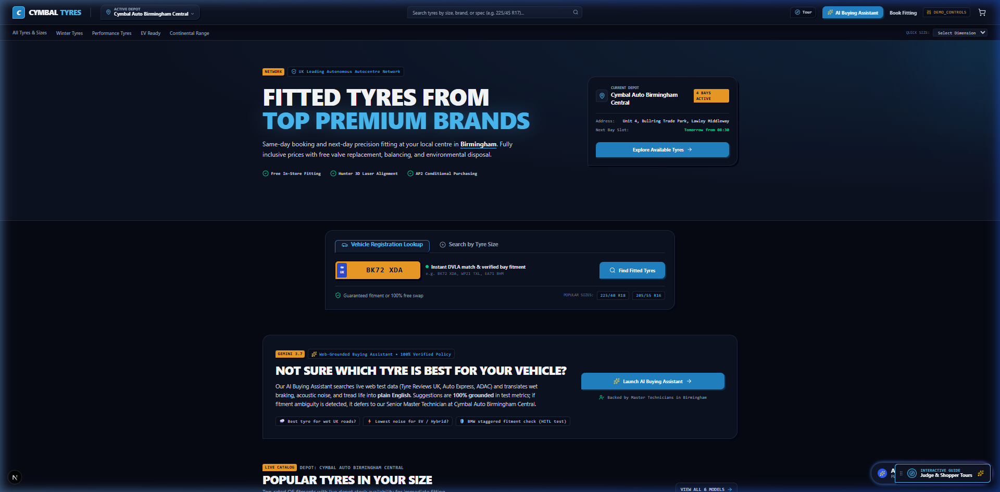
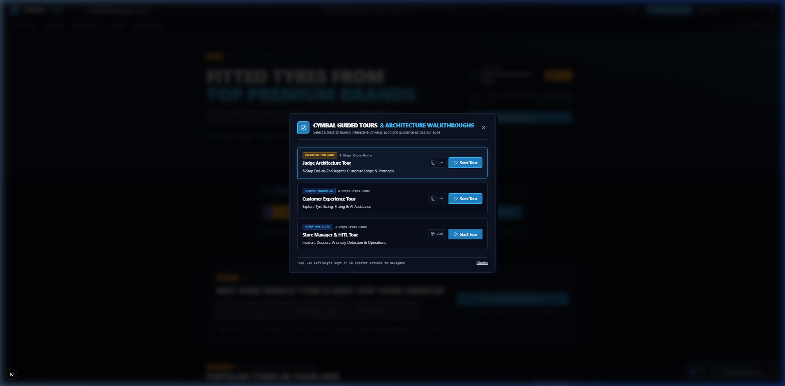
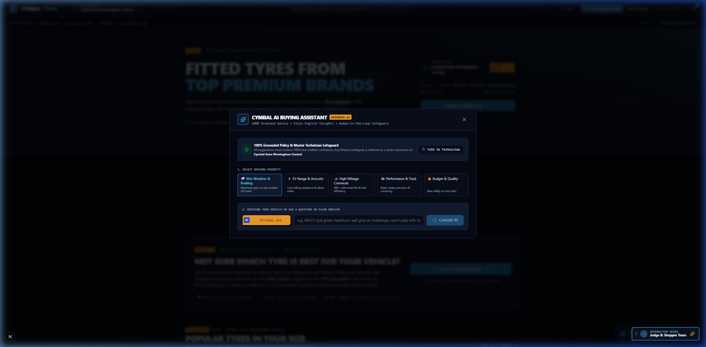
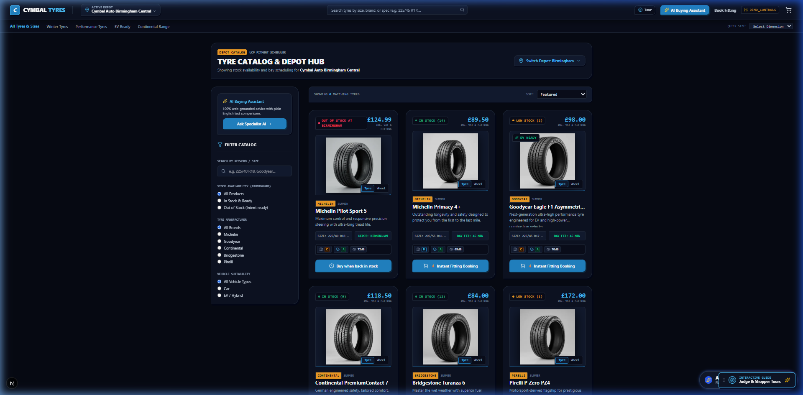
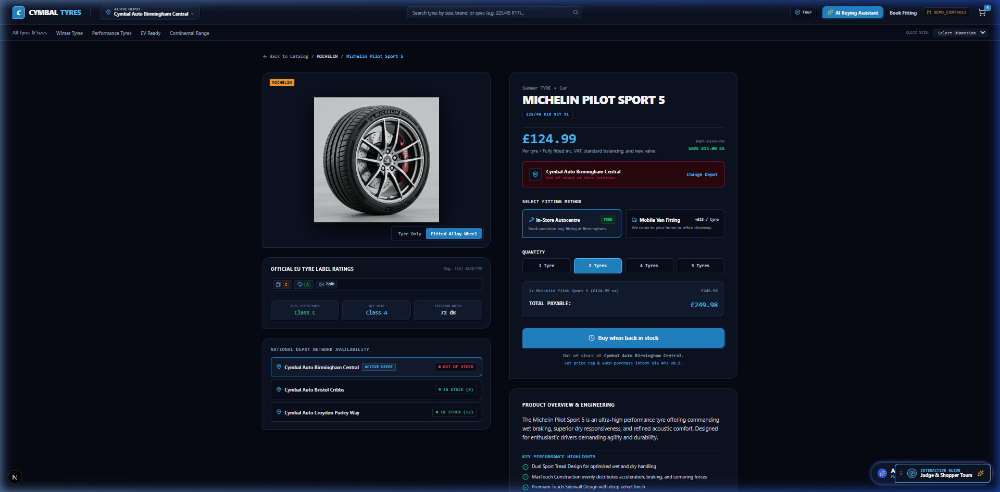
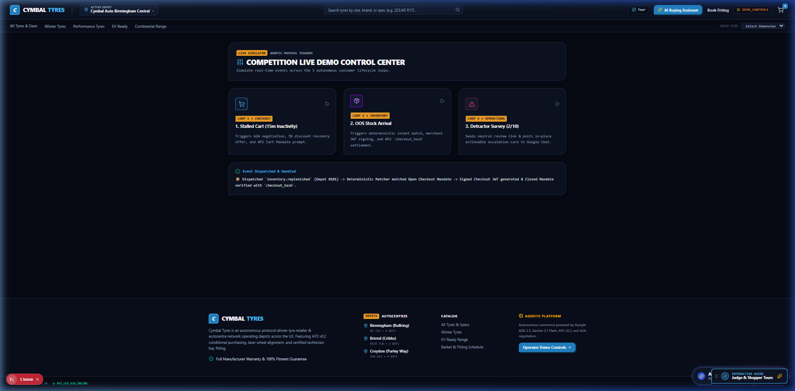
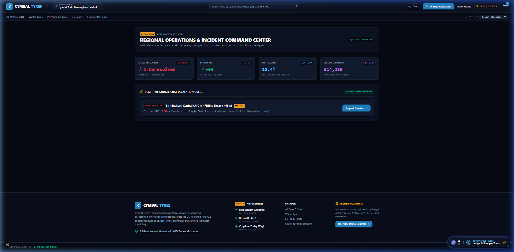
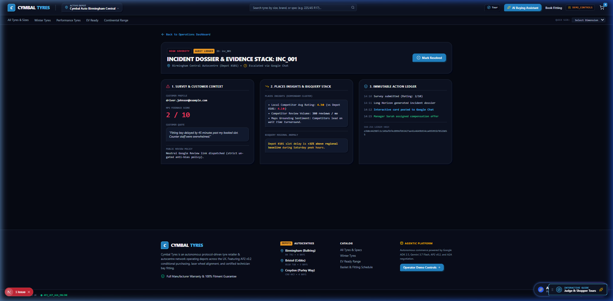

# 📸 Visual Walkthrough & System Screenshots

> **Cymbal Agentic Customer Lifecycle & Revenue Recovery Suite**  
> High-resolution visual tour and technical annotations of all user-facing, agentic, operational, and simulation surfaces.

---

## 📑 Table of Contents
1. [Homepage & Vehicle Fitment Search](#1-homepage--vehicle-fitment-search)
2. [Driver.js Multi-Track Guided Tours](#2-driverjs-multi-track-guided-tours)
3. [Gemini 3.7 Flash Grounded Buying Assistant](#3-gemini-37-flash-grounded-buying-assistant)
4. [Shop Catalog & Asymmetric Filter System](#4-shop-catalog--asymmetric-filter-system)
5. [Fitted Wheel & Tyre Package Visualizer](#5-fitted-wheel--tyre-package-visualizer)
6. [Live Agentic Protocol Simulator & Telemetry](#6-live-agentic-protocol-simulator--telemetry)
7. [Regional Manager Operations & Escalation Center](#7-regional-manager-operations--escalation-center)
8. [Incident Audit Dossier & Google Chat Action Cards](#8-incident-audit-dossier--google-chat-action-cards)

---

## 1. Homepage & Vehicle Fitment Search

### 🔍 Architectural Highlights:
- **Obsidian & Slate Canvas**: Neo-brutalist wiry aesthetic (`#060913` canvas, `#0c1222` containers, `#38bdf8` electric cyan accents).
- **British Yellow Plate Lookup**: Authentic DVLA registration selector (`.cymbal-plate`) with real-time vehicle fitment lookup.
- **Physical Autocentre Depot Scoping**: Dynamic binding to physical workshop locations (e.g. Birmingham, Bristol, Croydon) with Open Knowledge Format (OKF) inventory graph synchronization.
- **Draggable Guide Pill**: Floating, movable launcher pill in the bottom-right corner for 1-click access to interactive evaluator tours.

---

## 2. Driver.js Multi-Track Guided Tours

### 🔍 Architectural Highlights:
- **Judge Architecture Tour (6 Steps)**: Explains the multi-protocol lifecycle across routes with protocol badges (`[OKF PROTOCOL]`, `[GOOGLE ADK 2.5]`, `[AP2 v0.2]`, `[A2A + UCP]`, `[EVENT SIMULATOR]`, `[HITL + GBP]`).
- **Shopper Onboarding Tour (4 Steps)**: Guides consumers through reg lookup, dimension filtering, and bay fitting appointments.
- **Store Manager Operations Tour (3 Steps)**: Demonstrates workshop incident queues, sentiment anomalies, and stock replenishment dispatch.
- **1-Click Shareable URLs**: Copy direct evaluation links (`?tour=judge`, `?tour=customer`, `?tour=manager`).

---

## 3. Gemini 3.7 Flash Grounded Buying Assistant

### 🔍 Architectural Highlights:
- **Google ADK 2.5 Long Horizon Integration**: Real-time consultation engine powered by Gemini 3.7 Flash.
- **Multi-Factor Grounding**: Evaluates vehicle fitment specs, driving priorities (Wet Grip, Mileage, Track, Eco), seasonal weather patterns, and local depot inventory.
- **Human Escalation Fallback**: In case of low confidence or fitment ambiguity, automatically defers to certified senior technicians at the selected autocentre.

---

## 4. Shop Catalog & Asymmetric Filter System

### 🔍 Architectural Highlights:
- **Live Inventory Filter Matrix**: Multi-axis filtering by Season (Summer, All-Season, Winter), Vehicle Type (EV / Hybrid, Performance, SUV), and Availability (In Stock & Ready, Pre-Order Intent).
- **EU Tyre Label Badging**: Precise wet grip, fuel efficiency, and exterior noise dB badges adhering to official European tyre regulations.
- **Cryptographic Pre-Order Trigger**: Out-of-stock items allow buyer agents to register AP2 Intent Mandates for automated execution upon warehouse restocking.

---

## 5. Fitted Wheel & Tyre Package Visualizer

### 🔍 Architectural Highlights:
- **Interactive Alloy Wheel Toggle**: 1-click switch between Tyre Only and Fitted Alloy Wheel & Tyre Packages with dynamic pricing and fitted visual cutouts.
- **Workshop Bay Scheduling**: Select from In-Store Professional Fitting (with Hunter 3D laser alignment), Mobile Van Fitting, or Direct Delivery.
- **Instant Depot Inventory Synchronization**: Displays real-time unit count for the active depot with multi-centre stock comparison.

---

## 6. Live Agentic Protocol Simulator & Telemetry

### 🔍 Architectural Highlights:
- **Loop 1 — Stalled Checkout**: Simulates 15m cart inactivity $\rightarrow$ triggers A2A negotiation $\rightarrow$ evaluates deterministic `RecoveryOfferPolicy` (5% discount, £35 cap, 2h TTL) $\rightarrow$ generates signed SD-JWT Cart Mandate.
- **Loop 2 — OOS Inventory Replenishment**: Simulates stock arrival at Depot #101 $\rightarrow$ triggers `PurchaseIntentMatcher` $\rightarrow$ verifies RS256/ED25519 signature $\rightarrow$ performs AP2 `checkout_hash` settlement.
- **Loop 3 — Detractor Review Escalation**: Simulates 2/10 NPS survey submission $\rightarrow$ dispatches un-gated neutral Google Review link $\rightarrow$ posts interactive Card v2 to Google Chat.

---

## 7. Regional Manager Operations & Escalation Center

### 🔍 Architectural Highlights:
- **Network Health Matrix**: Real-time tracking of Active Escalations, 30-Day Rolling Network NPS (+64), Cart Recovery Reclaim Rate (18.4%), and Autonomous Pre-Auth AP2 Settlement Volume (£14,280).
- **Live Telemetry Stream**: WebSocket/SSE connection indicator showing real-time event ingestion across all UK autocentres.
- **Incident Escalation Queue**: Prioritized list of workshop incidents with direct deep-links to full audit evidence dossiers.

---

## 8. Incident Audit Dossier & Google Chat Action Cards

### 🔍 Architectural Highlights:
- **Immutable SHA-256 Audit Trail**: Cryptographic record of every agent action, trigger payload, and policy evaluation.
- **BigQuery + Places Insights Evidence Stack**: Correlates customer survey sentiment gaps against regional competitor benchmarks.
- **Google Chat HITL Integration**: Live visual representation of the in-place action card dispatched to store managers with `INVESTIGATE`, `ASSIGN`, and `DISMISS` buttons.
